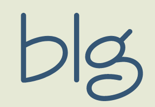
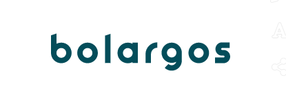
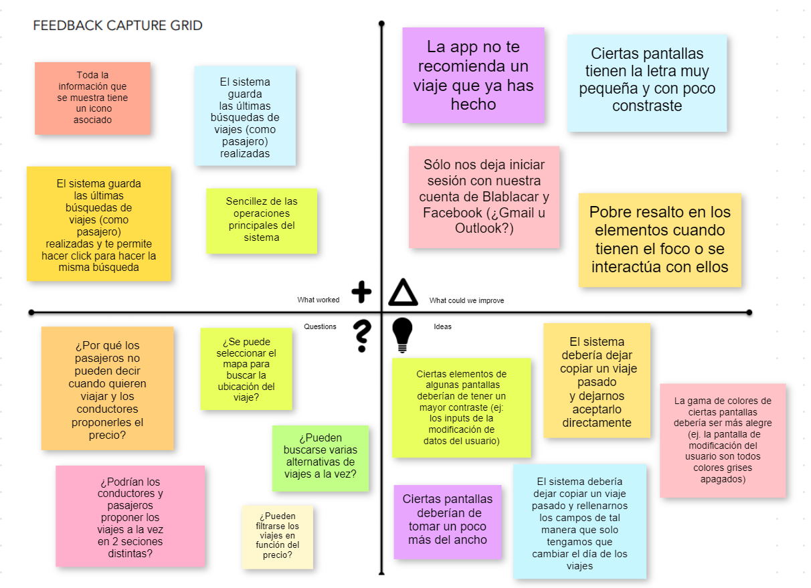
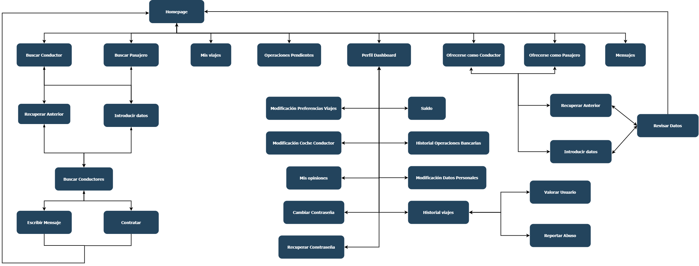
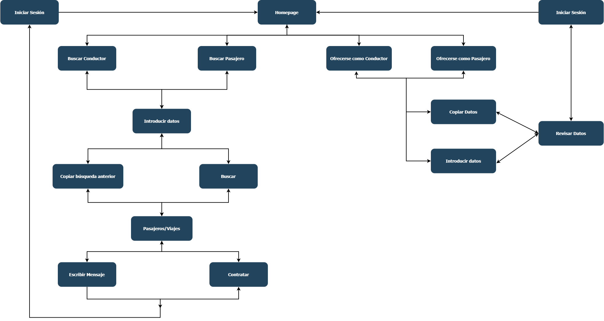
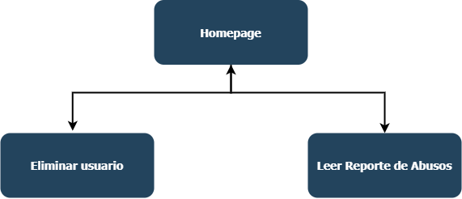

# DIU20
Prácticas Diseño Interfaces de Usuario 2019-20 (Economía Colaborativa) 

Grupo: DIU3.Bolargo.  Curso: 2019/20 

Proyecto: Bolargos

Descripción: Plataforma de viaje compartido.

Logotipo:

Miembros
 * :bust_in_silhouette:   [Francisco José Cotán López - @iscoct](https://github.com/iscoct)     :octocat: 

----- 

En esta práctica estudiaremos un caso de plataforma de economía colaborativa y realizaremos una propuesta para su diseño Web/movil. Utilizaremos herramientas y entregables descritos en el siguiente CheckList (https://github.com/mgea/UX-DIU-Checklist) 

Qué es economia colaborativa: Martínez-Polo, J. (2019). **El fenómeno del consumo colaborativo: del intercambio de bienes y servicios a la economía de las plataformas**, *Sphera Publica, 1*(19), 24-46. http://sphera.ucam.edu/index.php/sphera-01/article/view/363/14141434

>>> Este documento es el esqueleto del report final de la práctica. Aparte de subir cada entrega a PRADO, se debe actualizar y dar formato de informe final a este documento online. 

# Proceso de Diseño 

## Paso 1. UX Desk Research & Analisis 

 1.a Competitive Analysis
-----

>>> A mi grupo de prácticas se le asignó las plataformas de compartir viaje. Por mi parte, me decanto por **Blablacar**, la razón es porque esta, junto con **Amovens**, son el tipo de aplicaciones que más uso en el día a día. Este tipo de applicaciones tienen como objetivo abaratar costes y en muchas ocasiones reduce el tiempo de los desplazamientos entre ciudades para sus usuarios. Desde el punto de vista de la persona que no tiene medio de transporte proporciona el valor de que haya conductores que estén dispuestos a llevar a desconocidos si van a realizar un viaje similar con el objetivo de que entre los pasajeros le paguen su gasolina.
Ambos, conductor y pasajero, podrán ver los comentarios y valoraciones de personas que hayan realizado viajes con ellos en el pasado.
Personalmente he escogido **Blablacar** porque es la que lleva más tiempo en el mercado y es la aplicación que más cuota de mercado tiene para este tipo de servicios.
Aún así, ambas aplicaciones actualmente cobran comisión (Blablacar cobra algo más), proporcionan un seguro en caso de avería del vehículo y tienen el mismo fin. Amovens tiene además otro modelo de negocio que es el reting de particulares (prestan su vehículo por tiempo limitado) y otras personas alquilan ese coche (por tiempo limitado).

 1.b Persona
-----

>>> He seleccionado a Rocío y a Pedro porque son los 2 tipos de perfiles que suelen acceder a la aplicacíon con 2 propósitos totalmente distintos y fehacientes.

 1.c User Journey Map
----

>>> He escogido estos 2 tipos de journey map porque representan los deseos y motivos por los que nuestras personas entrarían y utilizarían la aplicación.

 1.d Usability Review
----
>>> - Enlace al documento: https://docs.google.com/spreadsheets/d/1E-e0byYJXL5u_i7jzD4xmzKFcew5D4V76reaqwthQpQ/edit?usp=sharing 
>>> - Valoración final (numérica): 73 - Good
>>> - Comentario sobre la valoración:  Blablacar tiene un diseño intuitivo combinando iconos con texto que permite realizar las operaciones principales de la aplicación de una manera muy sencilla. No obstante, el hecho de que haya pocos shortcuts para usuario más experimentados hace que estos pierdan un tiempo innecesario al hacer tareas más repetitivas como la inserción de datos para la creación de viajes similares, sino iguales.

## Paso 2. UX Design  

 2.a Feedback Capture Grid
----

>>> Comenta con un diagrama los aspectos más destacados a modo de conclusion de la práctica anterior,

  
>>> Con respecto a la propuesta de valor desde el punto de vista del negocio propongo viene de la posibilidad de permitir a los pasajeros proponer cuando quieren viajar y el precio que están dispuestos a pagar. De esta manera, los conductores no serán los que impongan los precios, sino que dependiendo de la oferta y la demanda, ambos tendrán que ir variando los precios de una manera más trasparentes y consensuada.
>>> Además, el sistema pretende realizar las operaciones repetitivas, como la creación de un nuevo viaje, mucho más breves, permitiendo que los usuarios utilizan la aplicación solo y exclusivamente por las operaciones por la que esta existe. Por último, el sistema pretenderá cobrar menos comisión que estas plataformas quitando el seguro que de viaje (el cual incurre un gasto).
>>> Para cerrar esta sección, el sistema también proveerá de un chat con un bot que permita responder a las preguntas más frecuentes que suelan realizar los usuarios.
>>> Por otra parte, con respecto a la propuesta de valor por parte de la vista de usuario, propongo un mayor resaltado de los elementos con los que se esté interactuando, así como una mejora en el aprovechamiento del espacio y un mejor contraste en ciertos elementos de entrada de datos.

 2.b Tasks & Sitemap 
-----

>>> Definir "User Map" y "Task Flow" ... 

|  | Usuario no registrado | Conductor | Pasajero | Administrador | Aclaraciones | Valoración |
|--|--|--|--|--|--|--|
| Buscar conductor para realizar viaje | L | M | H | L | Un conductor es probable que busque el precio de otros conductores para adaptar su precio al del mercado | 7 |
| Buscar pasajero para realizar viaje | L | H | M | L | Un pasajero es probable que busque el precio de otros pasajeros para adaptar su precio al del mercado | 7 |
| Rellenar los datos para publicar viaje como conductor | L | H | L  | L | Una persona que no se haya registrado podrá rellenar los datos de tal manera que antes de publicarlo le pedirá iniciar sesión (o registrarse) e introducir el vehículo con el que va a viajar en caso de que no esté registrado | 6 |
| Rellenar los datos para publicar viaje como pasajero| L | H | L  | L | Una persona que no se haya registrado podrá rellenar los datos de tal manera que antes de publicarlo le pedirá iniciar sesión (o registrarse) | 6 |
| Publicar viaje como conductor | - | H | - | - | No se entiende que otro usuario pueda publicarlo porque entraría en esta categoría. | 3 |
| Publicar viaje como pasajero | - | - | H | - | No se entiende que otro usuario pueda publicarlo porque entraría en esta categoría. | 3 |
| Registrarse | L | - | - | - | Se considera que la tarea de registrarse tiene poca frecuencia dado que en la mayoría de casos ésta sucederá solo una vez por usuario | 1 |
| Iniciar Sesión | H | - | - | - | - | 3 |
| Cerrar Sesión | - | M | M | M | - | 6 |
| Modificación de datos personales | - | L | L | L | Por datos personales entendemos: Foto, dirección, nombre, apellidos, fecha de nacimiento, teléfono, descripción | 3 |
| Modificación de preferencias en el viaje | - | L | L | - | Por preferencias entendemos: Si preferimos hablar mucho, hablar poco o permanecer callados, fumar en el coche, mascotas o poner música | 2 |
| Modificación del coche del conductor | - | L | - | - | - | 1 |
| Visualizar nuestras opiniones dadas y recibidas | - | M | M | - | - | 4 |
| Visualizar las opiniones recibidas de un conductor o pasajero | - | H | H | - | La única manera de ver el perfil con las opiniones es a través de un enlace redireccionado desde la publicación de un viaje o tras haber intercambiado un mensaje con este por chat mientras no se haya completado el viaje que tenga que realizar | 6 |
| Visualizar historial de los viajes que ha realizado un usuario | - | L | L | - | 2 |
| Visualizar operaciones bancarias realizadas | - | L | L | - | - | 2 |
| Pedir dinero del saldo que un conductor tenga pendiente | - | H | - | - | - | 3 |
| Escribir mensaje por chat | - | H | H | - | - | 6 |
| Ver viajes publicados | - | H | H | - | - | 6 |
| Aceptar/rechazar pasajeros en el viaje | - | H | - | - | - | 3 |
| Aceptar/rechazar viaje de conductor | - | - | H | - | - | 3 |
| Eliminar usuario de la aplicación | - | - | - | H | - | 3 |
| Comentar comportamiento de un usuario en un viaje realizado | - | H | H | - | - | 6 |
| Reportar abuso | - | L | L | - | - | 2 |
| Cambio de contraseña | - | L | L | L | - | 3 |
| Recuperación de contraseña | - | L | L | L | - | 3 |
| Darse de baja en la plataforma | - | L | L | L | - | 3 |

Frecuencias de uso:
- Alto (H - High) = 3 puntos
- Medio (M) = 2 puntos
- Baja (L - Low) = 1 punto
- '-', no corresponde esa tarea con el tipo de usuario = 0 puntos

 2.c Labelling 
----

**Nota**: Páginas como Iniciar Sesión, Cerrar Sesión, Registrarse, Contactos, FAQ y Sobre Nosotros no ha sido incluida porque se consideran Utility Navigation al estar disponibles entre todas las páginas. Esto es así porque Iniciar, Sesión, Registrarse y Cerrar Sesión estarán en la cabecera (véase Wireframes) y Contactos, FAQ, Sobre Nosotros... en el pie de página.

>>> Identificar términos para diálogo con usuario  

### Términos asociados a la navegación primaria o secundaria

|Término | Significado |
| ------------- | ------- |
| Mis Viajes | Muestra una lista de todos los viajes que están publicados para realizar en un futuro por el usuario. Por ejemplo, si tenemos un viaje como conductor el siguiente Jueves, el Viernes tenemos un viaje como pasajero, y el Domingo hacemos la vuelta como conductor, todos estos elementos aparecerán en esta sección |
| Operaciones Pendientes | Aquí aparecerán operaciones que el usuario necesita atender. Las operaciones que un usuario debe atender están: la aceptación o rechazo de una petición de un conductor o pasajero y comentar a un usuario tras haber hecho un viaje con él |
| Recuperar Anterior | Muestra una lista de datos que proporcionó el usuario para que busque o publique información con los datos previamente rellenos |
| Introducir Datos | Muestra un formulario con los datos necesarios para buscar o publicar un viaje ya sea como conductor o pasajero |
| Contratar | Botón que envía petición al Conductor pidiéndole permiso para viajar en su coche |
| Escribir Mensaje | Botón que le permite escribir un mensaje al conductor del vehículo |
| Modificación Preferencias Viajes | Aparece una lista de preferencias para que el usuario escoja la opción que quiera. Estas preferencias saldrán en el perfil del usuario y podrán ser consideradas para un viajar con una persona u otra |
| Sueldo | Pantalla que muestra nuestro sueldo actual disponible en la aplicación ganado a través de los viajes realizados como conductor. En esta pantalla también podremos pedir el sueldo disponible siempre y cuando tengamos una cuenta bancaria asociada en nuestros datos personales |
| Comentar Usuario | Formulario que nos permite valorar el servicio que nos ha dado un conductor o valorar el comportamiento de un pasajero y escribir un comentario justificando la valoración |
| Mis opiniones | Pantalla que nos muestra un historial de las opiniones dadas y realizadas |
| Mensajes | Chat con otros usuarios. Cabe destacar que sólo se podrán tener conversaciones con usuarios con quien vayamos a tener un próximo viaje y la única manera de buscar y escribir a otros usuarios es a través de Escribir Mensaje tras haber buscado un cierto viaje |

### Términos asociados a la Utility Navigation

|Término | Significado |
| ------------- | ------- |
| Iniciar Sesión | Modal que contiene un formulario para Iniciar Sesión con nuestra cuenta de la plataforma o Iniciar Sesión con Google o Facebook |
| Registrarse | Formulario para crear una cuenta en Bolargos |
| Preguntas frecuentes | Preguntas comunes con respuestas para ayudar al usuario |
| Términos y Condiciones | Información legal de la plataforma y de los contratos que se aceptan entre los conductores y los pasajeros y la empresa y los usuarios |
| Sobre Nosotros | Información relativa a la empresa |
| Redes Sociales | Lista de enlaces a las redes sociales de la plataforma/empresa |

### Arquitectura de Información para un usuario registrado

### Arquitectura de Información para un no usuario registrado

### Arquitectura de Información para un administrador

#### URL de las imágenes anteriores: [Cotán Arquitectura Información](https://drive.google.com/open?id=1MrfnQX7iBVVExESUZM7Akz4sD1JfnGze)

 2.d Wireframes
-----

>>> Plantear el  diseño del layout para Web/movil (organización y simulación )

El diseño se ha considerado para Web.

Dado el tamaño del Wireframe voy a dejar abierto mi fichero de Draw.io para que se pueda consultar ahí: [Cotán Wireframe](https://drive.google.com/open?id=132o5vKSst_92l3LeiWdhzfcHjKCGenxI)

## Paso 3. Make (Prototyping) 

 3.a Moodboard
-----

>>> Plantear Diseño visual con una guía de estilos visual (moodboard) 

  3.b Landing Page
----

>>> Plantear Landing Page 

 3.c Guidelines
----

>>> Estudio de Guidelines y Patrones IU a usar 

  3.d Mockup
----

>>> Layout: Mockup / prototipo HTML  (que permita simular tareas con estilo de IU seleccionado)

## Paso 4. UX Check (Usability Testing) 

 4.a A/B Testing
----

>>> Comprobacion de asignaciones para A/B Testing. Asignaciones https://github.com/mgea/DIU19/blob/master/ABtesting.md

>>>> Práctica A: 

 4.b User Testing
----

>>> Usuarios para evaluar prácticas 

| Usuarios | Sexo/Edad     | Ocupación   |  Exp.TIC    | Personalidad | Plataforma | TestA/B
| ------------- | -------- | ----------- | ----------- | -----------  | ---------- | ----
| User1's name  | H / 18   | Estudiante  | Media       | Introvertido | Web.       | A 
| User2's name  | H / 18   | Estudiante  | Media       | Timido       | Web        | A 
| User3's name  | M / 35   | Abogado     | Baja        | Emocional    | móvil      | B 
| User4's name  | H / 18   | Estudiante  | Media       | Racional     | Web        | B 

. 4.c Cuestionario SUS
----

>>> Usaremos el **Cuestionario SUS** para valorar la satisfacción de cada usuario con el diseño (A/B) realizado. Para ello usamos la [hoja de cálculo](https://github.com/mgea/DIU19/blob/master/Cuestionario%20SUS%20DIU.xlsx) para calcular resultados sigiendo las pautas para usar la escala SUS e interpretar los resultados
http://usabilitygeek.com/how-to-use-the-system-usability-scale-sus-to-evaluate-the-usability-of-your-website/)
Para más información, consultar aquí sobre la [metodología SUS](https://cui.unige.ch/isi/icle-wiki/_media/ipm:test-suschapt.pdf)

>>> Adjuntar captura de imagen con los resultados + Valoración personal 

 4.c Usability Report
----

>> Añadir report de usabilidad para práctica B 

## Paso 5. Evaluación de Accesibilidad  

  5.a Accesibility evaluation Report
----

>>> Indica qué pretendes evaluar (de accesibilidad) y qué resultados has obtenido + Valoración personal

>>> Evaluación de la Accesibilidad (con simuladores o verificación de WACG) 

## Conclusión / Valoración de las prácticas

>>> (90-150 caracteres) Opinión del proceso de desarrollo de diseño siguiendo metodología UX y valoración (positiva /negativa) de los resultados obtenidos  

